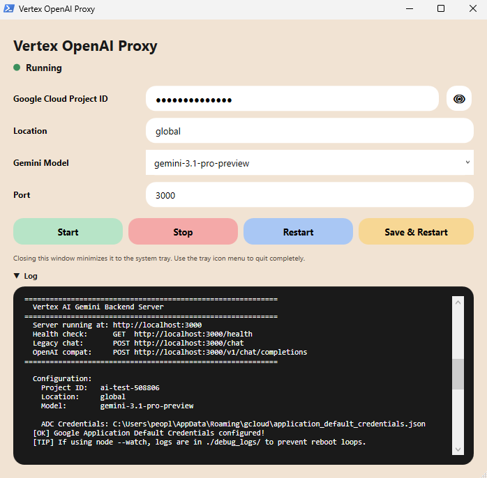

# Vertex AI to OpenAI Local Proxy

A local proxy that translates OpenAI-format API requests (`/v1/chat/completions`, `/v1/responses`) into Google Vertex AI (Gemini) API requests, so OpenAI-compatible tools and coding agents can talk to Gemini models on Vertex AI.

This project was inspired by an earlier open-source Vertex-to-OpenAI proxy concept, but the authentication, model routing, streaming parser, tool-calling logic, and installer/GUI have been substantially rewritten. See `CHANGELOG.md` for the full list of changes and [LICENSE](./LICENSE) for licensing terms.

## 🔥 Features
- **OpenAI API Compatibility:** Supports `/v1/chat/completions` and `/v1/responses`, both streaming and non-streaming.
- **Google ADC Authentication:** Uses `google-auth-library`'s `GoogleAuth` with Application Default Credentials — no OAuth client ID/secret needed. Authenticate once with `gcloud auth application-default login`.
- **Dynamic Model Routing:** The model requested by the client (e.g. `gemini-3.7-flash`, `gemini-3.1-pro`) is passed through to Vertex AI instead of being overridden by a fixed `.env` value.
- **Gemini 3.x Flash Tuning:** Detects Gemini 3 Flash models and configures `thinkingConfig` (`thinkingLevel: "high"`) appropriately instead of forcing generic temperature/topP/topK defaults.
- **Robust SSE Streaming Parser:** Buffers partial chunks and only parses complete `data:` lines, avoiding `Could not parse SSE event` errors.
- **Multi-turn Function Calling for Gemini 3:** Captures and restores the `thought_signature` required by Gemini 3 across tool-call turns using an LRU cache, avoiding `Function call is missing a thought_signature (400)` errors.
- **Multimodal Input:** Accepts images as data URIs or fetchable `http(s)` URLs and converts them to Gemini's `inlineData` format.
- **One-click installers + GUI control panel (Windows):** No manual `gcloud`/env setup required — see below.

## ⚙️ Installation

### One-command setup (recommended)

Clone the repo, then run the installer for your OS. It installs Node.js/gcloud if missing, runs `gcloud auth application-default login`, writes `.env` interactively, grants the `roles/aiplatform.user` IAM role, enables the Vertex AI API, and installs npm dependencies.

**Windows:**
```bash
git clone <this-repo-url>
cd vertex-openai-proxy
```
Then just double-click **`install-windows.bat`** in File Explorer (it launches the PowerShell installer for you, bypassing execution-policy prompts). Or run it from PowerShell directly:
```powershell
powershell -ExecutionPolicy Bypass -File .\install-windows.ps1
```
> If Node.js or the Google Cloud CLI had to be installed, the installer refreshes `PATH` automatically and continues in the same window. If a tool still isn't picked up, it'll ask you to close the window and re-run once.

The installer generates two launchers:
- **`vertex-openai-proxy-run.bat`** — plain console window running `npm run start`. Always works; use this if the GUI ever gives you trouble.
- **`vertex-openai-proxy-GUI-run.bat`** — opens the GUI control panel (no console window). Pure PowerShell + WPF — no Python, no pip packages, no separate runtime to install, since WPF ships with Windows itself.

**macOS:**
```bash
git clone <this-repo-url>
cd vertex-openai-proxy
chmod +x install-mac.sh
./install-mac.sh
```
The installer generates **`vertex-openai-proxy-run.sh`** (`chmod +x` already applied) so you can start the server later without remembering `npm run start`.

### Manual setup

1. Clone the repository and install dependencies:
```bash
git clone <this-repo-url>
cd vertex-openai-proxy
npm install
```

2. Configure your environment variables by creating a `.env` file:
```env
# Required
GOOGLE_CLOUD_PROJECT_ID=your-gcp-project-id
GOOGLE_CLOUD_LOCATION=global
GOOGLE_CLOUD_MODEL_ID=gemini-3.7-flash

# Optional
PORT=3000
```

3. Authenticate with Google Cloud using Application Default Credentials:
```bash
gcloud auth application-default login
```
Make sure your account has the `roles/aiplatform.user` role on the target project:
```bash
gcloud projects add-iam-policy-binding YOUR_PROJECT_ID \
  --member="user:YOUR_EMAIL@gmail.com" \
  --role="roles/aiplatform.user"
```

4. Start the server:
```bash
npm run start
```
The proxy listens on `http://localhost:3000` by default (override with `PORT`).

> Note: the repo also ships a legacy `auth.js` (`npm run auth`) that performs an OAuth client-credential flow. It is kept for reference but is not required — `gcloud auth application-default login` is the supported authentication path.

## 🖥️ GUI control panel (Windows)

Windows users get a small desktop app for managing the proxy, instead of a bare console window: `gui/VertexProxyGui.ps1`, pure PowerShell + WPF. No Python, no pip packages, no embedded browser engine — WPF is part of .NET and ships with every Windows install, so there's nothing extra to install or that can silently fail to initialize.



- **Start / Stop / Restart** the Node server as a background process (no console window).
- **Edit settings live:** Project ID (masked by default, with a show/hide toggle), Location, Gemini model (dropdown — also pulls the currently registered models from a running server's `/v1/models`), and Port.
- **Auto-saves `.env`:** if you change a field and click Start/Restart, the app detects the change and writes `.env` before launching, so the server never runs with stale settings.
- **Live log panel:** collapsible (▼/▶) so it doesn't have to take up the whole window.
- **System tray:** closing the window minimizes it to the Windows system tray instead of quitting. The tray menu offers 열기 (reopen), 서버 재시작 (restart just the Node process), GUI 재시작 (fully restart this app's own process), and 완전히 종료 (quit for good).
- **Single-instance guard:** launching a second copy asks whether to terminate the existing one and open fresh, instead of silently doing nothing.

Launch it any time with `vertex-openai-proxy-GUI-run.bat`, or manually:
```powershell
powershell -NoLogo -NoProfile -ExecutionPolicy Bypass -WindowStyle Hidden -File gui\VertexProxyGui.ps1
```

If the GUI ever fails to start, check `gui/crash.log` (written on any unhandled error) — or just use `vertex-openai-proxy-run.bat` instead, which runs the server directly with no GUI dependency at all.

## 🤖 Configuring your AI Agents

Point any OpenAI-compatible client at the proxy:

*   **API Provider:** `OpenAI Compatible`
*   **Base URL:** `http://localhost:3000/v1`
*   **API Key:** `sk-anything` (ignored by the proxy; it uses your local Google ADC credentials)
*   **Model Name:** whatever Gemini model you want to call, e.g. `gemini-3.7-flash`, `gemini-3.1-pro`, `gemini-1.5-flash-002`

### Supported Agents
Tested with OpenAI-compatible / agentic clients such as:
- Chatbox (agent/tool mode)
- Kilo Code
- Cline & Roo Code
- Any OpenAI-compatible library (LangChain, LlamaIndex, etc.)

## 🏗️ Architecture

1. **Request Interceptor:** Parses OpenAI-format messages (system/user/assistant/tool turns).
2. **Model Router:** `resolveVertexModel()` maps the client-requested model name to the Vertex model ID, applying aliases only when needed.
3. **Multimodal Normalizer:** Converts data-URI and `http(s)` images into Gemini's `inlineData` Base64 parts.
4. **SSE Stream Mapper:** Opens a streaming connection to `aiplatform.googleapis.com`, buffers partial `data:` chunks, and maps Vertex's candidate payloads into OpenAI-style stream events.
5. **Tool Call / `thought_signature` Cache:** An LRU cache persists `call_id → { name, signature }` so Gemini 3's `thought_signature` survives across turns and tool responses are matched back to the correct function name.
6. **Auth Handling:** Detects `401 Unauthorized` and instructs you to re-run `gcloud auth application-default login`.

## 📄 Changelog

See [CHANGELOG.md](./CHANGELOG.md) for a detailed breakdown of what was fixed compared to the original release.
